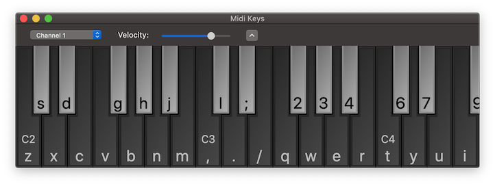

MidiKeys
==========

macOS application that presents an on-screen MIDI keyboard.

The keys are clickable and the physical keyboard is mapped to notes. Global shortcuts can be
configured to enable playing notes while MidiKeys is in the background.

Sends on any MIDI channel either to a chosen destination port or as a virtual source.
Listen to another device to show ntoes being played on the keys.

Runs on macOS 10.11 (Big Sur) and above. (Please note that you need to use at least version
[1.9.1](/flit/MidiKeys/releases/tag/v1.9.1) when running on 10.11 and above.)

Made available through the [Apache 2.0 license](LICENSE).

Copyright © 2002-2020 beatimprint LLC
